# Basic usage

## Connectors

What is the connector ? 

A connector is the object that Myddleware to connect to a solution. It allows Myddleware to read or write to the solution.

To create a new connector, click on ```Connector``` then ```Create```.

Select your solution in the list, then add the requested parameters, name your connector, test it and if the connection is OK, click on ```Save the connection```: 

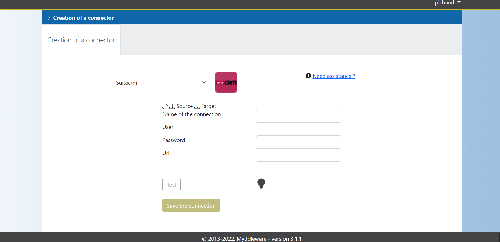  

You can create as many connectors as you want from the same solution. 
Now that you have created your connectors, you can set up your rule to transfer your data. 

## Rules

### Creating your first rule

Rules are at the core of how Myddleware works. You can create as many as you want and as many as you need.

A rule is basically a job which sends your data from a module to another module. It’s just like transfering something from a box to another, with all the changes it implicates if the first box is square and the second is a circle. The transfer is a copy, so no data can be erased.

To create a rule, log in to your Myddleware instance then click on **Rules** then **Creation** in the navbar.

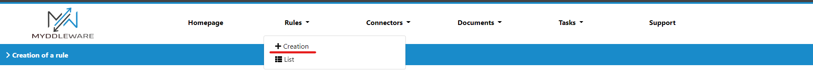

### Selecting data

First, you need to choose your environment's source and target connectors (see 1), then you will select the two modules you need to sync (see 2 & 3).

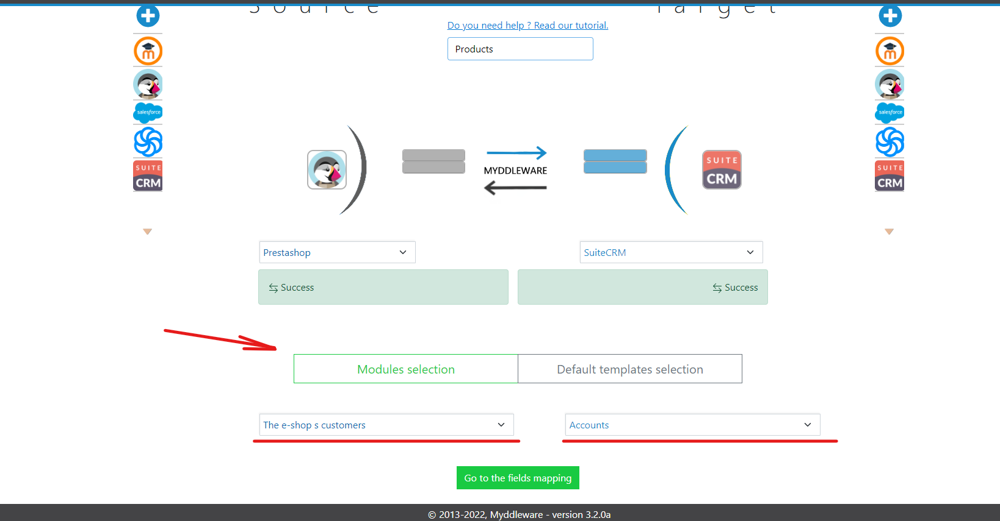

Do not forget to give a name to your rule or you won’t be able to select your modules.

In our example we chose **the e-shop s customers**, wich have the information we need to fill the ```Accounts``` module in our target.  

!> It is important to know exactly from which module the data you need comes from, and in which module you want it to be copied. Indeed, you won't be able to change this part later.

### Mapping fields

Once you've named & decided on the modules you want to synchronise, you will be redirected to the fields mapping step. This is where you will define the general pattern for each data transfer made by your rule, field by field.

To map your fields, you just have to drag and drop the source field to the target field. For instance, here we've selected the the source field **email** from the ```Customers``` module of our PrestaShop application and we've place it in the **email1** target field from the ```Accounts``` module of our SuiteCRM application. You can map as many fields as you need and can even send multiple sources into one target.

> NB: please note you don't have to map **all** source/target fields, you can simply select a few if that's what you need. However, some of them will be required, depending on the target app

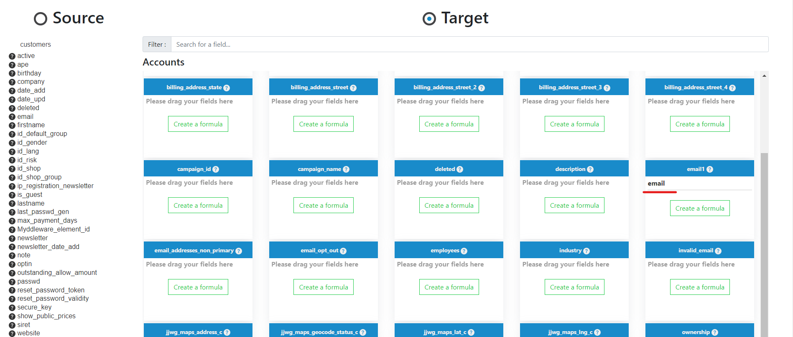

### Apply formulas to transform data before it is sent to the target app

Sometimes, the source data mapping doesn't quite match the target app's own mapping. But don't worry! Myddleware allows you to operate transformations on the data you want to send in order to fit with the target requirements. This is possible thanks to Myddleware's *formulas* system.
Indeed, for each target field, you can create a formula to modify the source data to fit the type, length,... and other requirements from the target field.

**Example:**
In our example, we want to map PrestaShop Customers' data to be sent to SuiteCRM's Accounts module. However, PrestaShop only maps Customers' **first_name** and **last_name** whereas SuiteCRM provides us with a **name** field. Ideally, we would want to add up our source's  **first_name** and **last_name** in order to fit SuiteCRM's name field's logic. To do so, we need to drag and drop this **first_name** and **last_name**, and create a formula to concatenate them.

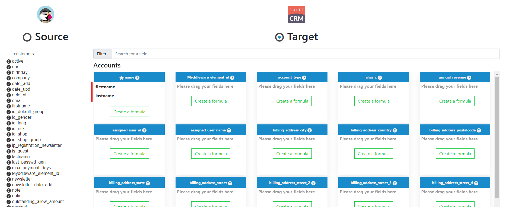

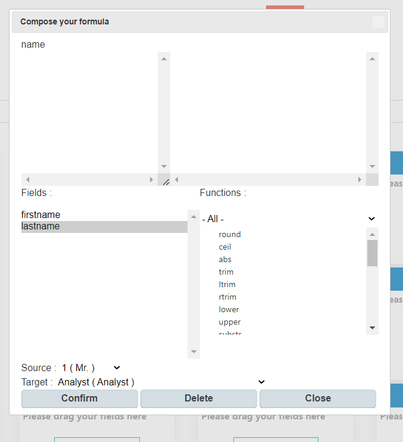

You can double-click on the data in ```Fields``` to make it appear in the formula area. To concat use ```‘.’```, the quotes are here to make a space. The result will be to have the first name, a space, the the last name in our fields name.

>To test your formula and your mapping, you can go to ```simulation```

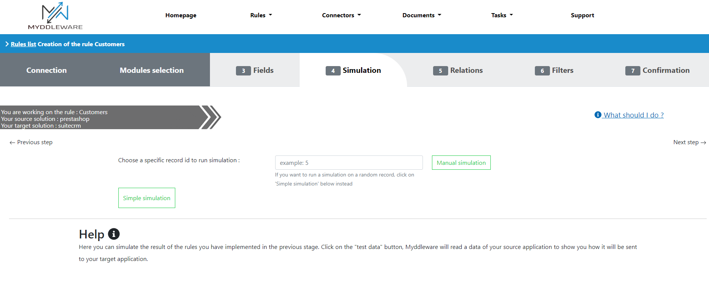

Then you can run ```Simple simulation``` to visualize an example of the transfer, you can also check if your formula transform the data the way you want.

!>We will talk about the tabs "Relationships" and ```filters``` in another chapter

### Confirm the rule

To finish the creation of this rule, click on ```Confirmation``` :

You will then see 2 parameters :

<!-- tabs:start -->

#### **Synchronization type :**

 Depending on the solution, you could have the choice to read newly created data or all data, created or modified in the source module. In our example, if you only want to send new customers created in Prestashop to SuiteCRM, then select ```Create data only```. Otherwise, if you only want to send customers’ modifications in Prestashop to SuiteCRM, then select ```Create and update data```. In our example we selected ```Create and update data```. This process is based on the reference date that you can set up.

#### **Avoid duplicates fields :**

 You can select one of these fields if you want Myddleware to check if a record with the same value already exists in the target solution. If so, Myddleware will only update this data and won’t create a duplicate. But to be able to duplicate a field, the field must be present in the fields mapping. In our example, we selected ```Email```.

<!-- tabs:end -->

Finally, you can click on ```Confirm``` to create the rule. After which, the page with the detail of your rule should appear.

## Rule detail

When you open a rule, all its details appear :

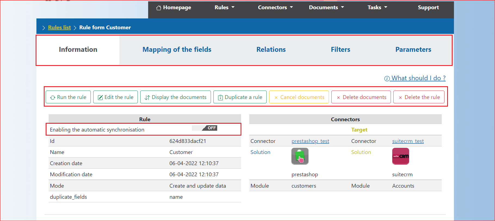

You will see an ```On/Off``` switch enabling automatic synchronisation. 

If this option is on, the job which synchronises data in background task will run this rule. If it is off, the background job will not run this rule. 

**Here you have the option to:**

- Run the rule : It allows you to run the rule manually even if the switch ```Enablingthe automatic synchronisation``` is off.
- Edit the rule: It allows you to edit the rule.
- Display the transfers : It allows you to see all the data transfers generated by therule.
- Delete the rule : It allows you to delete the rule.

You can also see all the tabs if you want to display the fields mapping, the relationships, the filters or the parameters.  

### Parameters


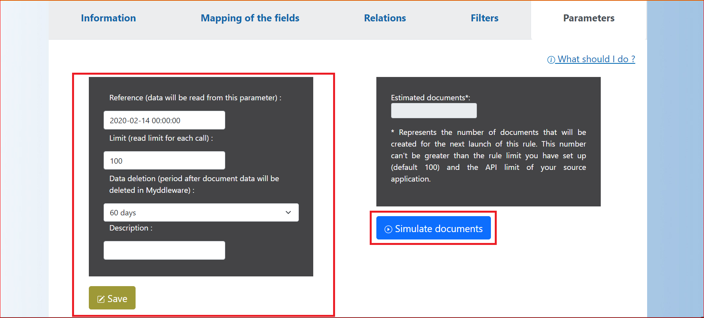

**In the parameter tab :**

- The reference date : This is the date Myddleware uses for data reading in source applications. 
For example, if you set today’s date, only today’s created or modified data will besent to your target application. (This also depends on the mode of your rule :the ```Create and update data``` rule mode concerns modified data while the ```Create data only``` rule mode concerns created data). If you want to migrate your data, all you need to do is put this date in the past. Then all created/modified data after this date will be read by Myddleware.
- Deleting data : You can ask the system to delete the transferred data of your rule after x days. Touse this functionality, you have to set the background task ```clear data```. See the install guide. For your information, this job will delete all the data you have transferred for this rule, except the ids which are necessary for the correct functioning of Myddleware.
- Simulate transfer: there is an option to simulate the amount of data you want Myddleware to read depending on the reference date. You can change the reference date if you need to then click on ```Save``` to obtain a simulation of the number of transfers.

### Run the rule

!>If you didn’t change the reference date, you can create a new record in your source application. Then return to your rule and click on ```run the rule```.

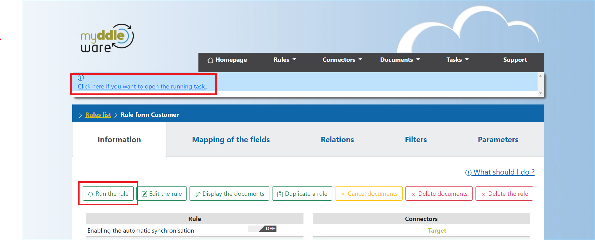

Once your rule is executed, you can view the current task by clicking on the link atthe top of the page.Youwill then be redirected,

You will find all the information related to your task. To view all your transfersrelated to your rule, click on ```Display the document```.

If you click on a transfer, you will be able to open it, you will then see what Myddleware has read in the source application and what it has been sent in thetarget application.

### Rule related

Here we will see how to create a new rule related to another one. This will allow us, for example, to send orders in one solutionand transform yhem into opportunities in another.

#### Select data and Map your fields

!> To create a rule that allows two rules to connect to each other, both rules must have the same connector.

Create a new rule with the same applications and connectors. Then click on ```Go to the fields mapping```.

> If you need to transfer a date, we often have to change the format because the solutions do not have the same format. You can then create your formulas, for example: ```changeFormatDate( {add_date}, "Y-m-d H:i:s", "Y-m-d" )```. You can need it in case you want to filter on dates.

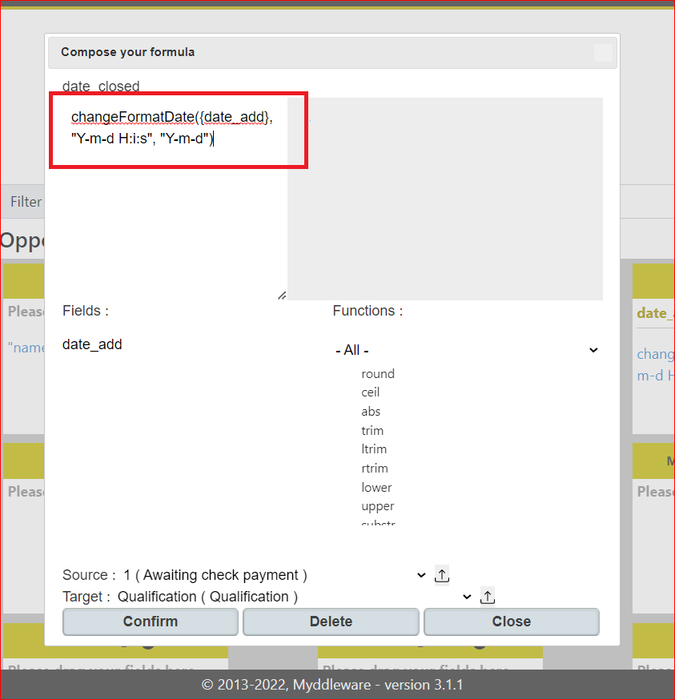

#### Create relationship

We can create relationships in Myddleware that not only allow us to transfer unrelated data items but whole data models entirely.

In the example below, we want to send the order in SuiteCRM, we have to link it to the related account. We need to retrieve the account id corresponding to the customer linked to the order in Prestashop.

In the relations tab, we retrieve the SuiceCRM account ID from the previously created ```Customer```  rule using the customer ID in the Prestashop order.

#### Filter your data

You can also decide to filter the data you want to send into your target application. To do so, click on the ```Filters``` tab :

You can then save your rule.

### Transfers

Now run your rule by clicking on ```Run the rule```.

Open a transfer and you will see that Myddleware retrieved the ```account id``` from the ```customer id``` on the Prestashop order using the rule ```Customer``` previously created.

In SuiteCRM, the opportunity is now linked to the account.

The transfer is the record which stores the data read in the source application, transformed by Myddleware and sent to the target application.

#### Search transfers

If you click on ```Transfer => List```, you will be able to search tranfers. For example, you can search by rule and status :

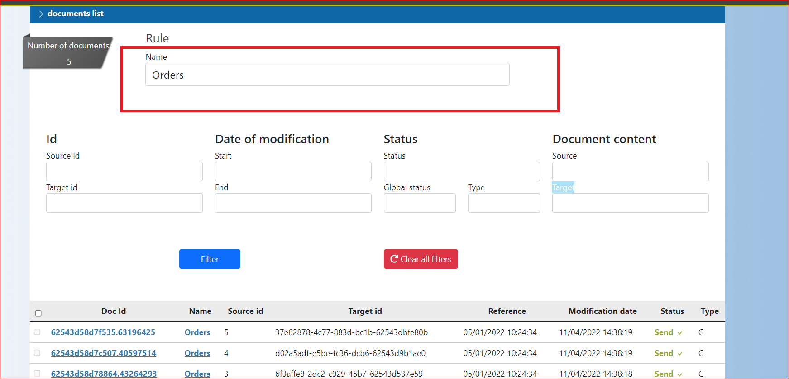

You can search by creation/modification date, global status and ID too. You can use the character ```%``` in the search. For example,  if we search ```%4d60%```, we will find all the ids which contain the string ```4d60```.

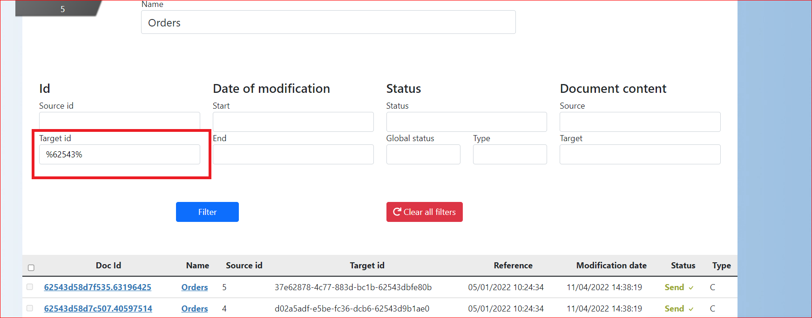

Now open a transfer and follow the detailed explanation on the transfer.
#### Transfer details

There are 3 distinct parts in a transfer :

<!-- tabs:start -->
#### **The header data:**

- Rule name and version related to this transfer
- Status related to the global status (see below):
    - New (Open) : When the transfer is created.
    - Create_KO (Cancel) : When the transfer creation failed.
    - Filter (Cancel) : When the transfer is filtered because of the rule filter.
    - Filter_OK (Open) : When the transfer is not filtered.
    - Filter_KO (Error) : When Myddleware failed to check if the transfer has to be filtered.
    - Predecessor_OK (Open) : When all transfers with the same source ID are closed.
    - Predecessor_KO (Error) : When at least 1 transfer with the same source ID isn’t closed. Myddleware will wait until the other transfer have been successfully sent before sending this transfer. In our example, we can’t update the status of an order if this order hasn’t been created in the target application.
    - Relate_OK (Open) : When no other transfer related to this transfer (in another related rule) isn’t closed.
    - Relate_KO (Error) : When at least 1 transfer related to this transfer (in another related rule) isn’t closed. In our example, we can’t send an order if the customer hasn’t been sent.
    - Transformed (Open) : When the transfer is successfully transformed.
    - Error_transformed (Error) : When Myddleware failed to transform the transfer.
    - Ready_to_send (Open) : When the transfer is ready to be sent to the target application.
    - Error_history (Error) : When Myddleware failed to get the data from the target application, only when the transfer updates data.
    - Send (Close) : When the transfer is successfully sent.
    - Error_sending (Error) : When Myddleware failed to send the data to the target application.
    - No_send (Cancel) : When there is no identification between the data in the target application and the data Myddleware should sent. In this case, Myddleware cancels the transfer.
    - Cancel (Cancel) : When the transfer is manually cancelled.
- Mode indicates the mode of the rule related to the transfer:
    - 0 : The rule will create and update data to the target application.
    - C : The rule will only create data to the target application.
    - S : The rule will search for data in the target application (no creation and no modification).
- Type of the transfer :
    - C : The transfer creates data into the target app.
    - U : The transfer updates data into the target app.
- Global status
    - Open : The transfer is still in process.
    - Cancel : The transfer has been cancelled.
    - Error : The transfer is locked and has an error.
    - Close : The transfer has been successfully sent.
#### **The detail of the data in 3 parts:**

- Source : Data read in the source application
- Target : Data sent to the target application
- History : If the transfer updates data in the target application, we get the data from the target application before we modify it.

#### **The logs with the transfer with its historic status**

<!-- tabs:end -->

#### Manage a transfer in error

*This section is still under construction*

#### Mass action

You can reload or cancel several transfers at the same time in the transfer list view.

!> Only transfers in error can be reloaded or cancelled.

Select the transfer you want to reload or cancel and click on ```Cancel transfers``` or ```Reload transfers``` :

### Tasks

A task is an execution of the program which reads data, manages all ûnclosed or cancelled transfers from the source application, and then sends them to the target application. This allows for many transfers to be carried out in one task.

To list the tasks, click on ```Task then``` on ```List``` :

Then open a task by clicking on its Id to see the details of what happened during the execution of the task :

If the task is still running (status Start), there will be option to click on 2 buttons :

- Refresh : To refresh the page and see how the task is executing and when it is finished.
- Stop task : To stop the task.

### Going deeper

#### Relationships

Below you will learn how to create relationships with different data models (```One to many```, ```Many to one```)


#### One to many relationships

To create a one to many relationship you will need to create 2 rules that will be used to send 1 module from the source application to 2 modules in the target application.

Go to the the fields mapping tab and choose the fields you are most interested in.

Then in the ```Relations``` tab :

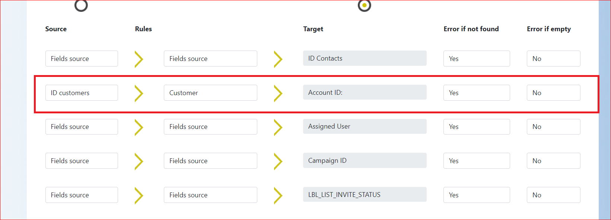

Here you need to use a rule that already has a relationship (with the target and source applications you are interested in).
For example, if we want to link contacts to corresponding accounts already send to a target application with a previous rule.
In this scenario, Myddleware should retrieve the ```account ID``` of the target application in the previous rulee and send it to the contact in order to link this contact to the already created account. 

!> Now save the rule and run it, don’t forget to put the reference date in the past if you want to retrieve data which already exists.

Now open a transfer. You will find that Myddleware has linked the right account to the matching contact

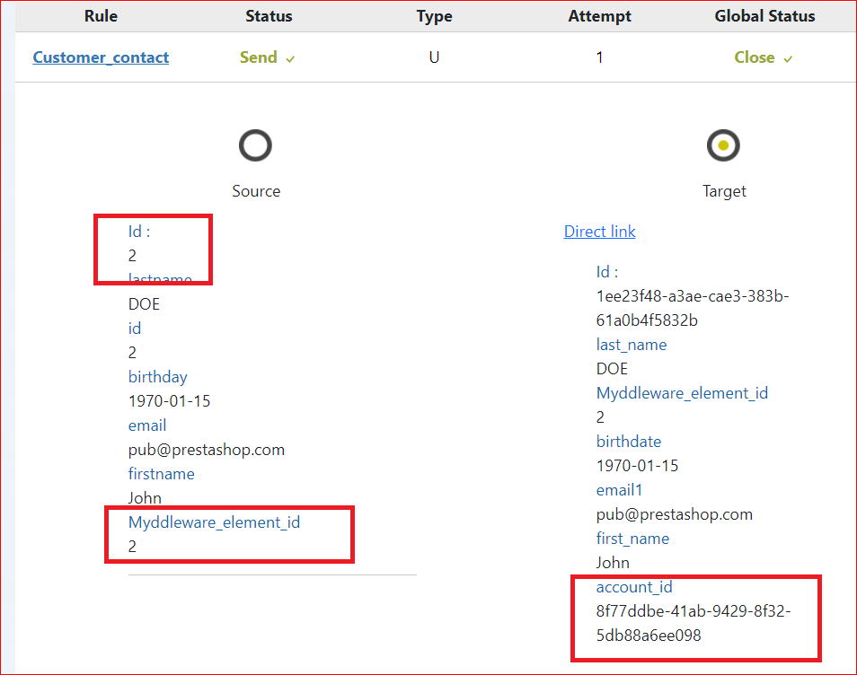


#### Many to one relationships

Here, we want to create 2 rules to send 2 modules from the source application to 1 module.

Go to the the fields mapping tab and choose the fields you are most interested in.

Then in the ```Relations``` tab.

In our example, we want to send the adresses to the accounts that have already been sent to SuiteCRM in a previous rule. Just like the one to many relationship scenario, Myddleware will have to spot the SuiteCRM account IDs in the previous rule then update this account.

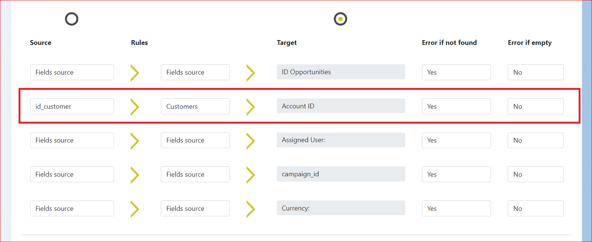

Here, we use the Account ID ie the ID of the target module in the current rule. This means that this rule will only update data.

!> Now save the rule and run it. Don’t forget to put the reference date in the past if you want to retrieve already exiting data.

Now open a transfer and you will see that Myddleware has found the right account to update.

The transfers and the accounts are now updated as expected.
#### Bidirectional rule

In our example, we have only shown you how to send data from Prestashop to SuiteCRM. But in reality, Myddleware allows you to send data in both directions, from Prestashop to SuiteCRM and from SuiteCRM to Prestashop.

One of the rules we have created is sending Prestashop Customers to SuiteCRM contacts. In this case, only modifications in Prestashop will be sent to SuiteCRM. But if the contact is modified in SuiteCRM, the modification won’t be sent to Prestashop.

So let’s create a new rule to send the modification of the SuiteCRM contacts to Prestashop. Select the same modules and connectors you used in your previous rule but in the opposite direction :

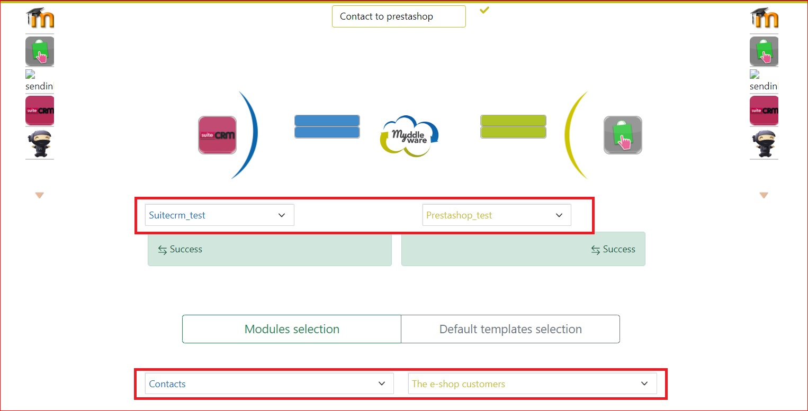

Go to fields mapping and map at least the fields firstname, lastname and email. Make sure you don’t use a field that will be updated everytime like the modification of the date of the record, you could create an infinite loop.

Go to validation. A new field will be displayed ie “Bidirectional synchronization” in addition to the opposite rule. Select the opposite rule and click on ```Confirm``` :

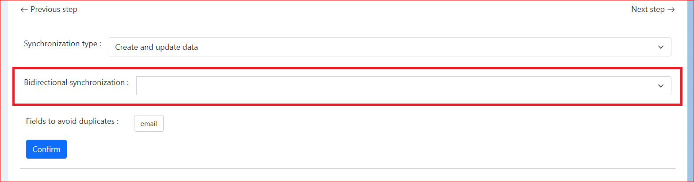

The opposite rule is displayed on the rule’s detailed view :

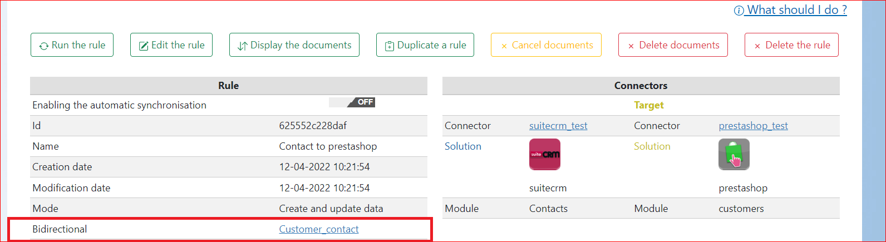

Activate both rules. Now, to test your bidirectional rule, modify a customer in Prestashop, go to the the rules list view and click on ```Execute all active rules```.

Now open the task and you will see the contact that has been sent to SuiteCRM.

Notice that data have been changed. Return to the rules list view and click again on ```Execute all active rules```. Another transfer is sent as a result of Myddleware reading in SuiteCRM and detecting the modification we’ve just made. The transfer will automatically be cancelled to avoid an infinite loop.

The reason for this being that the data is already updated in Prestashop (which is normal since Prestashop is the source solution from which the data is being sent). So Myddleware detects that there are no modifications to send to Prestashop and thus cancels the transfer and stops what could result in an infinite loop.


Now you have to do this test in the opposite direction. To do so, modify the contact in SuiteCRM and return to the rule list view. Click once again on ```Execute all active rules```. You only need to run the rules once, not twice as we did in the previous case. In fact, it depends on which rule has been activated first when you click on “Execute all active rules”. In one direction, you have to click on “run all rules” twice, in the other direction, once is enough.

At this point, your modification in SuiteCRM should be visible in Prestashop :

Once Myddleware detects the modification in Prestashop, it will try to send it to SuiteCRM. But once again, the transfer will be cancelled to avoid an infinite loop :

If the transfer isn’t cancelled, your server will continue to update the same contacts every time. To avoid this, you will have to detect why the transfer isn’t cancelled. It could be because you used the modification date, or because the data format is not the same in both applications. To solve this problem, remove some fields in your rule or create a formula to have the same data format in both applications.
## Set up your jobscheduler (Jobscheduler/crontab)

### Using jobscheduler in the Myddleware interface

On your Myddleware interface you have the possibility to create your periodic tasks, click on your username on the top right and click on ```"jobscheduler"``` :  

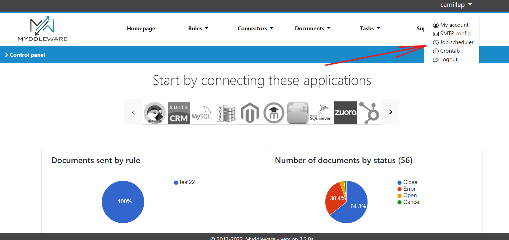

Here you will find the list of your tasks, with the possibility to modify or delete a task through the action column.


To create a new task click the New command button. You will then be redirected to the command creation page:  

Here you will first have to select the type of command you want to create, depending on your choice you will have different parameters to enter.


**For the following fields**

<!-- tabs:start -->
#### **Period**

this is the time interval corresponding to the frequency of execution of your task

#### **Job order**

This is the order in which the tasks will be executed

#### **Active**

 Active ? Allows you to deactivate/activate a scheduled task

<!-- tabs:end -->

### Using crontab in the Myddleware interface

Just like with Jobscheduler you can use to create new periodic tasks directly via Myddleware, to do this click again on your username, then click on ```"Crontab"```.

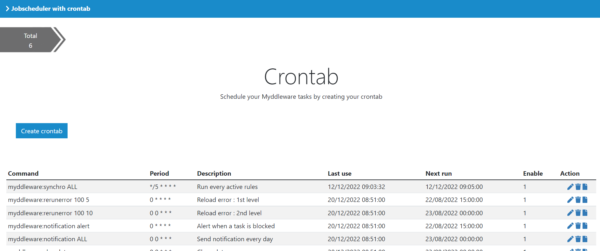

**For the following fields**

<!-- tabs:start -->
#### **Arguments**
*This section is still under construction*

#### **Number**
*This section is still under construction*

#### **Description**
*This section is still under construction*

#### **Running instance**
*This section is still under construction*
#### **Period**

 As for jobscheduler, period is a time interval corresponding to the frequency of execution of your task. Here on the other hand the syntax to use is precise example (*/5* ** * : in the order of writing, minute, hours, day of the month, day of the week).

 Syntax example :

 *This section is still under construction*

<!-- tabs:end -->

Here you will find a table with all your periodic tasks, to create a new command click on the ```"create crontab"``` button

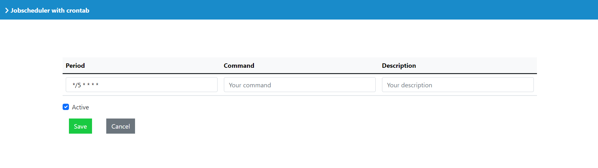
